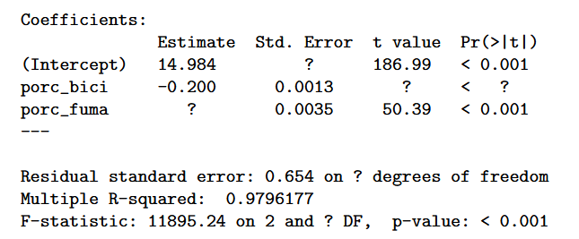

# Entrega 3 - Modelos lineales

Madeline Cecere Pinto

## Ejercicio 3

Dentro del paquete *faraway* encontrará un conjunto de datos llamado *cheddar*. En el mismo se encuen- tran 30 observaciones correspondientes a 30 hormas de queso cheddar y 4 variables. La primera de ellas un score otorgado por un conjunto de jueces y las restantes corresponden a concentraciones de ácido acético, ácido sulfhídrico y ácido láctico (estos 3 están expresados en escala logarítmica).

```{r}
#SE PUEDE INSTALAR EL FARAWAY PERO FALLA POR EL REFORMULAS QUE FALLA POR EL Rdpack AAAAAAAA

load("cheddar.rda")
dataset <- cheddar


str(dataset)
```

1\) Ajuste un modelo donde se explique el sabor a partir de las 3 concentraciones

```{r}

modelo <- lm(taste ~ Acetic + H2S + Lactic,
             data = dataset)

summary(modelo)
```

2\) Lleve a cabo la prueba de significación del modelo con un nivel de significación del 5 % e interprete el resultado.

$$
H_0) \beta_1 = \beta_2 = \beta_3 = 0 \quad H_1) \text{ alguno distinto de cero}
$$

El p-valor asociado a esta prueba esta dado en el summary con el F-statistic, en este caso p-valor = 0.00000381. Para un nivel de significación del 5 % , $\alpha = 0.05$ , tenemos que:

$$
p-valor = 0.00000381 < 0.05 = \alpha
$$

Entonces, se tiene evidencia suficiente para rechazar la hipotesis nula. Decimos que el modelo es significativo en su conjunto. Al menos una de las variables explicativas aporta información para explicar el sabor del queso

3\) Lleve a cabo las pruebas de significación de cada variable con un nivel de significación del 5 %.

Para cada variable, se realiza la prueba:

$$
H_0 ) \beta_i = 0 \qquad H_1) \beta_i \neq 0
$$

Con la regla de decision:

$$
p-valor < 0.05 \implies \qquad \text{Se rechaza la nula y la variable es significativa}
$$

$$
p-valor \ge 0.05 \implies \qquad \text{No se rechaza la nula y la variable no es significativa}
$$

Para Acetic, p-valor 0.94 \> 0.05. No es significativa al 5% (o incluso para niveles mas altos)

Para H2S, p-valor 0.00425 \< 0.05. Es significativa al 5%

Para Lactic, p-valor 0.03108 \< 0.05. Es significativa al 5%

4\) Vuelva a ajustar el modelo removiendo la/las variables explicativas que no hayan resultado signifi- cativas en el punto anterior

```{r}
modelo2 <- update(modelo, . ~ . -Acetic)
summary(modelo2)

```

4\) Determine qué porcentaje de la variabilidad del sabor es explicada por las variables de este último modelo

R\^2 = 0.6517. El 65% de la variabilidad del sabor es explicada por las variables del modelo sin la variable Acetic

6\) Obtenga un intervalo de confianza para la respuesta media de una horma con valores promedio en las variables de este último modelo

Valores promedio

```{r}
mean_H2S <- mean(dataset$H2S)
mean_Lactic <- mean(dataset$Lactic)
```

Usamos la funcion predict para hallar el IC, fijando alpha = 0.05

```{r}
nuevo <- data.frame(H2S = mean_H2S,
                    Lactic = mean_Lactic)

predict(modelo2,
        newdata = nuevo,
        interval = "confidence",
        level = 0.95)

```

El intervalo obtenido representa un intervalo de confianza del 95 % para el valor medio del puntaje de sabor de hormas de queso cheddar que poseen una concentración promedio de ácido sulfhídrico y ácido lactico.

$$
IC_{95\%} = 24,533 \pm 3.724
$$

## Ejercicio 4

Un grupo de investigadores relevaron información en 498 pueblos para determinar qué asociación tienen algunos factores sociales respecto de la prevalencia (qué tan frecuente es una cierta enfermedad) de enfermedades cardíacas. Las variables *porc_EC*, *porc_fuma* y *porc_bicicleta* representan el porcentaje de personas en cada pueblo que padecen enfermedades cardíacas, que fuman y que van a su trabajo en bicicleta. A partir de estos datos se ajustó el siguiente modelo lineal:

$$
porc\_EC_i = \beta_0 + \beta_1 porc\_fuma_i + \beta_2 porc\_bici_i +\varepsilon_i 
$$

A continuación se presenta el summary posterior al ajuste de este modelo en R

```{r}

```

A partir de esta salida, se pide:

1\) Determine si el modelo es significativo en su conjunto.

La significación global del modelo esta dada por el F-statistics, esta prueba de hipotesis busca responder si alguna de las variables explicativas tiene un efecto o aporte significativo para explicar la variable respuesta ($\beta_i \neq 0$). El p-valor de la prueba es \< 0.001 por lo que para una significación del 0,1% ,$\alpha = 0.001$ , el modelo es significativo en su conjunto.

2\) Determine cuántos grados de libertad tiene el estimador de la varianza de los errores.

Los DF son $n - k - 1$. En este caso $n = 498$ y $k = 2$. Por lo que, los grados de libertad del estimador de la varianza de los errores (residual ES) es $498 - 2-1 = 495$

3\) Complete los valores marcados con ? en la tabla.

Para completar la tabla usamos que:

$$
tv_i = \frac{\hat{\beta_i}}{SE_i}
$$

Hallar el Std. Error (SE) del incercept ($\beta_0$)

```{r}
#SE = betagorro / tv
14.984/186.99
#0.08
```

Hallar el t-value de porc_bici

```{r}
-0.200/0.0013
#-153.8462

```

Hallar el estimate de porc_fuma

```{r}
#betagorro = SE*tv
0.0035* 50.39
#0.176365
```

Para hallar el p-valor de porc_bici, tenemos que el t-value hallado fue -153.8462. Comparado con el de porc_fuma con t-value 50.39 se tiene que su p-valor es \< 0.001. Como el valor absoluto el t-value de porc_bici es mayor que el de porc_fuma, podemos acotar el p_valor, entonces:

$$
p-valor_1 < 0.001
$$

Por último, falta hallar el DF del F-statistic que coindice con el del residualSE. Entonces:

$$
DF_{F-stat} = 495
$$

4\) Determine qué variables explicativas son significativas

Para un nivel de siginifación del 0,01%, $\alpha = 0.001$, todas las variables del modelo tienen un aporte significativo (p-val \< 0.001)

5\) Interprete los coeficientes asociados a las dos variables explicativas.

-Porc_fuma (coeficiente = 0.176365): manteniendo constante el porcentaje de personas que van en bicicleta al trabajo, por cada aumento de 1 punto porcentual en la proporción de fumadores de un pueblo, el porcentaje de personas con enfermedades cardíacas aumenta en promedio en 0.176365 puntos porcentuales.

-porc_bici (coeficiente = -0.200): manteniendo constante el porcentaje de fumadores, por cada aumento de 1 punto porcentual en la proporción de personas que van al trabajo en bicicleta, el porcentaje de personas con enfermedades cardíacas disminuye en promedio en 0.200 puntos porcentuales.

6)Interprete el valor del R2

Aproximadamente el 98% de la variabilidad de la variable respuesta, porcentaje de personas con enfermedades cardíacas, se logra explicar con el modelos (porcentaje de personas que fuman y que van a su trabajo en bicicleta).
